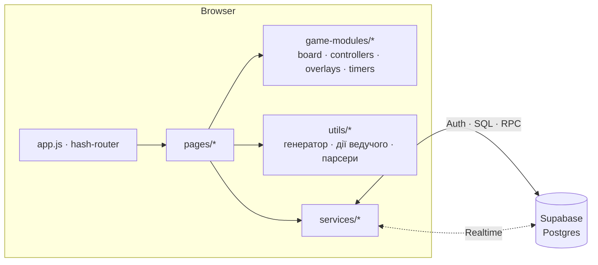

<div align="center">


# TrueBunker

**Онлайн-гра «Бункер» для компанії друзів — прямо в браузері.**
Кімнати з кодом, ведучий із повним набором інструментів, голосування, таймери, власні паки карток і шість візуальних тем.

[](#стек)
[](#архітектура)
[](https://crisswen.github.io/)
[](#локальний-запуск)

**[Грати →](https://crisswen.github.io/)**

</div>

---

## Що це

Катаклізм знищив світ, а місць у бункері вистачить лише для половини гравців. Кожен отримує випадковий набір характеристик (професія, здоров'я, хобі, фобія, рюкзак…), відкриває їх по одній, переконує інших, що саме він потрібен бункеру, і в кінці раунду кімната голосує, кого виключити.

TrueBunker бере на себе все, що зазвичай робиться на папірцях: генерує персонажів і бункер, синхронізує екрани всіх гравців у реальному часі, веде таймери, лог подій і голосування. Ведучий отримує окрему панель, щоб гнучко керувати грою.

## Можливості

### Для гравців
- **Реєстрація за ім'ям і паролем** (мінімум 6 символів), без пошти.
- **Лобі**: створити кімнату, увійти за кодом або за посиланням-запрошенням (`#/lobby?join=КОД`), повернутися в активні ігри.
- **Особистий екран гри** з блоками:
  - опис бункера: історія, кімнати, локація, площа, час перебування, запаси їжі та води, проблема, предмети;
  - катаклізм з описом, населенням і, якщо задано, власним таймером;
  - ваші характеристики. Замочок на кожній картці відкриває її решті, закриті значення бачите лише ви;
  - таблиця гравців із відкритими характеристиками й лічильником «Живі / Всі»;
  - таблиця «Спец. можливості» (по дві на гравця);
  - голосування «Кого виключити з бункера?» з підсумковою таблицею, де видно, хто за кого голосував і який відсоток голосів отримав кандидат;
  - особисті нотатки (живуть лише в поточній вкладці, ніде не зберігаються);
  - «Лог подій» з останніх 100 записів.
- **Режим глядача**: хто заходить, коли гра вже йде, бачить дошку з позначкою «Ви слідкуєте за грою», але без власних карток і голосу. Вибулі гравці лишаються в грі, але не голосують.
- **Живі ефекти**: плаваючий таймер обговорення, окремий таймер катаклізму, модалка «Час сплив», анімований кидок d20/d6 з конфеті, глобальні сповіщення від ведучого.
- **Шість тем оформлення** і профіль гравця.

### Для ведучого
Плаваюча кнопка відкриває **Панель ведучого**:

| Група | Дії |
|---|---|
| **Таймер** | запустити на N секунд, пауза, зупинка (синхронно в усіх) |
| **Бункер** | змінити місткість (+/−), перегенерувати або вписати власне значення будь-якого поля, керувати предметами (додати/видалити), змінити катаклізм |
| **Гравці** | перегенерувати характеристику, змінити стаж і ступінь хвороби, інвертувати стать, вилікувати («ідеально здоровий») |
| **Картки** | додати гравцеві додаткову картку (з пулу або власним текстом), видалити інвентар |
| **Хаос** | обмін характеристиками між гравцями (або випадково між усіма), круговий зсув характеристики за годинниковою стрілкою чи проти, «вкрасти характеристику» |
| **Гра** | запустити голосування і завершити його, кинути d20 або d6, вигнати або повернути гравця, передати роль ведучого |
| **Сесія** | **«Скасувати попередню дію»**, «Почати гру наново», «Закрити кімнату» |

Кожна дія записується в лог, а гравці отримують сповіщення. Таймер працює автономно й не засмічує екран тостами.

### Паки карток
- **Базовий пак** — основа гри, доступний усім. Редагувати його може лише адміністратор, і в ньому немає кнопки «Очистити все», бо гра не повинна лишитися без карток.
- **Особисті паки** — створюйте, редагуйте й видаляйте власні набори. Ведучий обирає пак у кімнаті очікування.
- **Редактор пака**:
  - картки по категоріях, по одній на рядок, з лічильником і **пошуком** по всьому паку;
  - окрема **форма катаклізмів**: назва, опис, таймер у хвилинах, час перебування в місяцях, населення;
  - **стадії** для професій, хобі та здоров'я;
  - діапазони **віку та зросту**;
  - кнопки «Скасувати зміни», «Очистити все» (в особистих паках) і попередження про незбережені зміни при виході.
- **Автодоповнення з базового пака.** Якщо в особистому паку якоїсь категорії не вистачає карток на всіх гравців, гра добере їх з базового, а в «Лог подій» запише, що саме додано.

## Як це працює

1. Ведучий створює кімнату й ділиться кодом або посиланням.
2. Гравці заходять у кімнату очікування. Для старту потрібно **від 6 гравців** (до 15 в лобі). Після старту решта приєднуються як глядачі.
3. Ведучий обирає пак і натискає «Почати гру». Генератор будує бункер (місткість дорівнює половині гравців) і персонажів.
4. Гравці відкривають характеристики, обговорюють, ведучий запускає голосування. Воно закривається автоматично, щойно проголосували всі живі.
5. Раунди обговорення й голосування повторюються, поки ведучий не завершить гру.

### Характеристики гравця

Стать · Вік · Статура й зріст · Професія · Здоров'я · Хобі · Риса характеру · Фобія · Рюкзак · Крупний інвентар · Додаткові відомості · 2 спец. можливості (плюс мітка «childfree», якщо пак це дозволяє).

## Тема, баланс і конфіг

Теми перемикаються в профілі, вибір запам'ятовується, а тема застосовується до першого рендеру, тому сторінка не блимає:

`Класична (Dark)` · `Сталкер (Grimdark)` · `Fallout (Terminal)` · `Cyberpunk (Neo-Noir)` · `Кріо-Станція (Deep Sea)` · `Потужність (Patriot)`

Усі числа балансу зібрано в `js/config/game-config.base.js`:

| Параметр | Значення за замовчуванням |
|---|---|
| `minPlayersToStart` / `maxPlayersInLobby` | 6 / 15 |
| `bunkerCapacityDivisor` | 2 (місткість = гравці ÷ 2) |
| `bunkerSize` | 25–350 м² (більші бункери випадають рідше) |
| `perfectHealthChance` | 20 % |
| `bunkerProblemChance` | 65 % |
| `childfreeChance` | 30 % |
| `bunkerItemsCount` | 1–5 предметів |
| `maxLogEntries` | 100 |
| `foodMonths` | пороги дефіциту, часткового запасу, точного запасу й надлишку |

Для локальних експериментів створіть `js/config/game-config.local.js`. Він **ігнорується Git**, підхоплюється автоматично й **глибоко зливається** поверх бази, тож достатньо вказати лише ті поля, які змінюєте.

## Стек

- **Frontend**: чистий JavaScript (ES Modules), HTML і CSS. Без фреймворків і збірки.
- **Бекенд**: [Supabase](https://supabase.com), тобто Auth, Postgres і Realtime (через `supabase-js` з CDN).
- **Роутинг**: власний hash-роутер (`#/login`, `#/lobby`, `#/game`, `#/profile`, `#/packs`, `#/pack-editor`) із захистом маршрутів для неавторизованих.
- **Хостинг**: GitHub Pages.

## Архітектура



Ключові рішення:

- **Кімната = один рядок у БД.** Стан гри живе в `bunker_state` та `players_state` (jsonb), а Realtime розсилає зміни всім клієнтам. `mergeRoomState` зливає часткові оновлення, щоб великі поля не зникали.
- **Єдиний годинник.** Таймери зберігаються як абсолютні мітки часу, а `server-time.js` вирівнює їх із серверним часом (через RPC `get_server_time`; без неї гра тихо повертається до локального часу).
- **Дії ведучого — шари без циклів:** `constants` → `room-store` / `card-pools` → `common` / `characteristics` → `actions-*`. Усе збирається у фасаді `host-actions.js`.
- **Скасування дій.** Перед кожною дією робиться знімок кімнати, тож «Скасувати попередню дію» повертає стан одним кліком.
- **Чисті функції рендеру.** `board-view-model.js` перетворює стан кімнати на готові дані для блоків дошки без DOM і без запитів до БД.
- **Авторитет ведучого.** Автозавершення голосування виконує лише клієнт ведучого, щоб уникнути гонки одночасних записів.

### Структура проєкту

```text
.
├── index.html
├── css/
│   ├── styles.css · header.css
│   ├── components/        # lobby, bunker, host-panel, voting, timers, packs, dice…
│   └── themes/            # classic, stalker, fallout, cyberpunk, cryo, patriot
├── icons/ · textures/
└── js/
    ├── app.js             # роутер
    ├── config/            # баланс гри (base + local)
    ├── pages/             # auth, lobby, game, profile, packs, pack-editor
    ├── game-modules/
    │   ├── board/         # блоки дошки: бункер, катаклізм, таблиці, голосування, лог
    │   ├── controllers/   # поведінка: голосування, замочки, вибір пака, панель ведучого
    │   ├── host-panel/    # розмітка панелі ведучого
    │   ├── overlays/      # кубик, тости, діалоги підтвердження
    │   └── timers/        # таймер обговорення та катаклізму
    ├── services/          # supabase, packs-store, room-subscription, server-time
    ├── ui/                # розмітка редактора паків
    └── utils/
        ├── host/          # дії ведучого (players, bunker, steal, timer, session)
        ├── game-generator.js · start-game.js
        └── pack-*.js · theme-manager.js · log-writer.js …
```

## Локальний запуск

Збірка не потрібна, достатньо будь-якого статичного сервера (ES-модулі не працюють з `file://`):

```bash
git clone https://github.com/CrissWen/Crisswen.github.io.git
cd Crisswen.github.io

# варіант 1
python -m http.server 8000
# варіант 2
npx serve .
```

Відкрийте `http://localhost:8000`. Також підійде розширення **Live Server** у VS Code.

### Власний Supabase-проєкт

За замовчуванням застосунок підключений до спільного проєкту (`js/services/supabase.js`). Щоб розгорнути власний бекенд:

1. Створіть проєкт у Supabase та підставте свої `supabaseUrl` і публічний (`publishable`) ключ у `js/services/supabase.js`.
2. Налаштуйте в БД таблиці `rooms`, `packs`, `pack_cards` із RLS-політиками, а також RPC `save_personal_pack`, `delete_personal_pack` і (необов'язково) `get_server_time`.
3. Увімкніть Realtime для таблиці `rooms` і вхід за паролем у Auth.

Вхід реалізовано через службовий e-mail `ім'я@bunker.local`, тому підтвердження пошти в Supabase Auth має бути вимкнене.

## Внесок

Pull request-и й ідеї вітаються. Для нових карток і сценаріїв найпростіше створити власний пак у редакторі, а для змін балансу достатньо поправити `game-config.base.js`.

---

<div align="center">

Зроблено для вечорів, коли хтось обов'язково «просто не вміє працювати руками».

</div>
